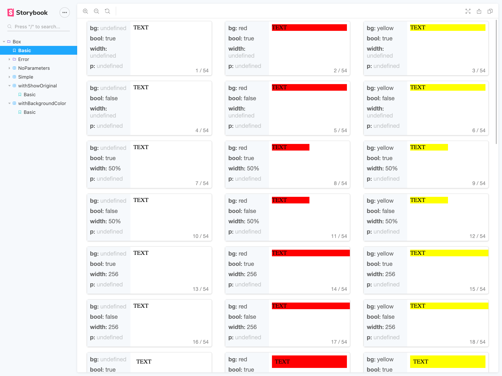

# storybook-addon-matrix

Storybook addon for rendering components with a matrix of props.

[![stars][]][github]
![Build Status][actions]
[![Downloads][]][npm]
[![Version][]][npm]
![size][]
![MIT License][license]

[version]: https://flat.badgen.net/npm/v/storybook-addon-matrix
[downloads]: https://flat.badgen.net/npm/dm/storybook-addon-matrix
[license]: https://flat.badgen.net/badge/license/MIT/blue
[stars]: https://flat.badgen.net/github/stars/tomoya/storybook-addon-matrix
[size]: https://flat.badgen.net/bundlephobia/minzip/storybook-addon-matrix
[npm]: https://npmjs.com/package/storybook-addon-matrix
[github]: https://github.com/tomoya/storybook-addon-matrix
[actions]: https://flat.badgen.net/github/checks/tomoya/storybook-addon-matrix

```sh
npm i storybook-addon-matrix
```

View demo: https://storybook-addon-matrix.now.sh/



## Usage

Globally

```js
// .storybook/preview.js
import { addDecorator } from '@storybook/react';
import { withMatrix } from 'storybook-addon-matrix';

addDecorator(withMatrix);

// Your.stories.tsx
import * as React from 'react';
import { Box } from './Box';

export default {
  title: 'Box',
  component: Box,            // Must be present
  parameters: {
    matrix: {                // Parameter name is matrix
      pattern: {             // Let you write your matrix pattern
        bg: ['white', ...],  // Format is key: [value1, value2, ...]
        width: [undefined, ...],
      },
      // backgroundColor: 'rgba(0,0,0,0.7)', // Optional: If you want to change backgournd color
    },
  },
};

export const Basic = () => <Box>TEXT</Box>;
```

Or individual

```js
// Your.stories.tsx
import * as React from 'react';
import { withMatrix } from 'storybook-addon-matrix';
import { Box } from './Box';

export default {
  title: 'Box',
  component: Box,
  decorators: [withMatrix],
  parameters: {
    matrix: {
      pattern: {
        bg: ['white', 'blue', 'red', 'yellow'],
        width: [undefined, '50%', 256],
        p: [1, 2, 3],
      },
    },
  },
};
```

Do you want to more info? We have an [example](https://github.com/tomoya/storybook-addon-matrix/tree/master/example)! Please let you try it.

```sh
$ git clone https://github.com/tomoya/storybook-addon-matrix.git
$ cd ./storybook-addon-matrix/example
$ yarn install
$ yarn start
```

## Contributing

1. Fork it (<https://github.com/tomoya/storybook-addon-matrix/fork>)
2. Create your feature branch (`git checkout -b feature/fooBar`)
3. Commit your changes (`git commit -am 'Add some fooBar'`)
4. Push to the branch (`git push origin feature/fooBar`)
5. Create a new Pull Request

## License

[MIT License](https://github.com/tomoya/storybook-addon-matrix/blob/master/LICENSE)
